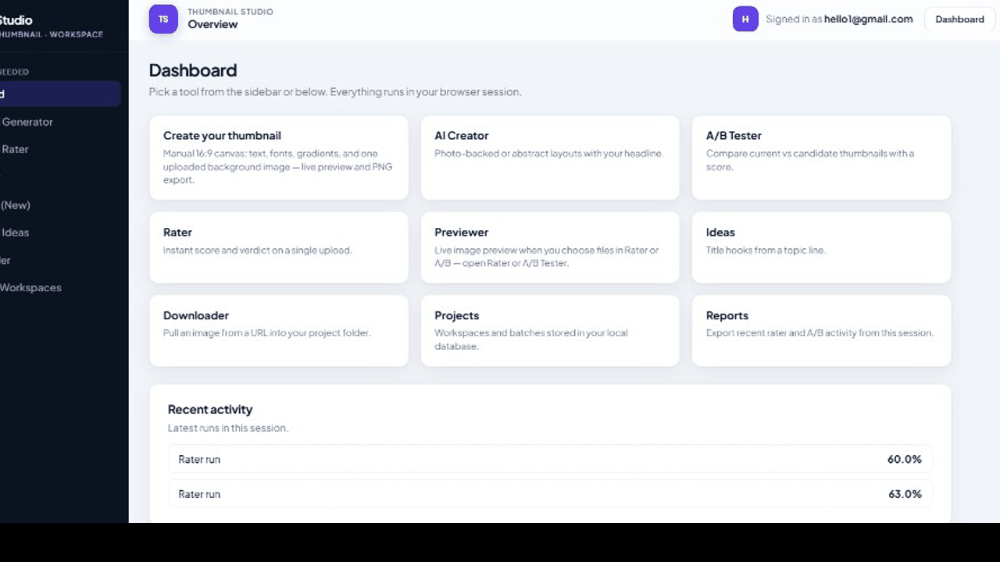
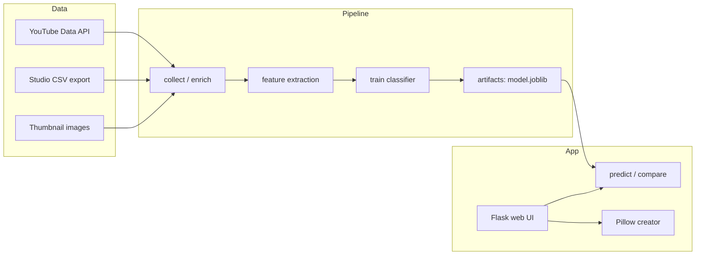

# YouTube Thumbnail Studio

[](.github/workflows/ci.yml)
[](https://www.python.org/downloads/)
[](LICENSE)
[](https://flask.palletsprojects.com/)
[](https://scikit-learn.org/)
[](https://www.sqlite.org/)
[](https://python-pillow.org/)

**End-to-end thumbnail optimization studio for YouTube creators:** collect channel history, train a thumbnail-aware model with optional Studio analytics, score or A/B-test thumbnails, and ship designs through a **local web app** (auth, reporting, visual editor, and free AI composer).

> **Interview angle:** This project demonstrates ownership across the full ML product lifecycle: data ingestion, feature engineering, model training, inference, web UX, auth, persistence, testing, and CI.

---

## Resume highlights

- Built a full-stack ML product: ingestion → features → training → inference → production-style Flask UI.
- Implemented creator workflows that mirror real use cases: scoring, A/B testing, AI concept generation, project tracking, and exports.
- Delivered engineering quality standards: smoke tests, GitHub Actions CI, structured repo docs, and resilient UI loading.

## What problem this solves

Creators often design thumbnails by intuition only. This app adds a measurable workflow:
- generate ideas fast,
- score variants consistently,
- compare alternatives directly,
- and iterate with a repeatable system instead of guesswork.

---

## Demo (local)

| Step | Action |
|------|--------|
| 1 | Clone the repo, then run **`start.bat`** (Windows) or **`run-local.bat`**. |
| 2 | Open **`http://127.0.0.1:8080/`** (or the port printed in the console). |
| 3 | Create an account or configure Google OAuth (see below). |

**Verify the new UI loaded:** View page source and confirm `id="ts-embedded-ui"` and `data-ui-mode="embedded-css"`.  
**Debug endpoint:** `GET /api/build-info` returns template paths and embedded CSS size.

If you see `ERR_CONNECTION_REFUSED`, the Flask process is not running—keep the terminal window open while using the app.

---

## Open the website from this repo

### Fastest way (Windows)

1. Download or clone this repo.
2. Double-click `start.bat` (or run `run-local.bat` in terminal).
3. Open the URL printed in the terminal, usually:
   - `http://127.0.0.1:8080/` (main app)
   - `http://127.0.0.1:8080/studio` (thumbnail editor page)

### Manual way (any OS)

```bash
python -m venv .venv
# Windows:
.venv\Scripts\activate
# macOS/Linux:
# source .venv/bin/activate

pip install -r requirements.txt
python app.py
```

Then open `http://127.0.0.1:8080/` in your browser.

---

## Screenshots

### Live demo (GIF)
> Optional: export a 10–20s walkthrough GIF and add it here as `docs/screenshots/demo.gif`.



### Key product views


---

## 60-second recruiter demo

1. Run `start.bat` (or `run-local.bat`) and open `http://127.0.0.1:8080/`.
2. Sign in and show the **Dashboard** with all creator tools.
3. Open **Create your thumbnail** and generate one thumbnail from text/background.
4. Open **Rater** and score a thumbnail (show verdict + confidence).
5. Open **A/B Tester** and compare two versions (show recommendation).
6. Open **AI Creator** to generate a fast concept thumbnail.
7. End with **Reports** export and mention CI + tests (`pytest`, GitHub Actions).

---

## Results snapshot

- The app supports a complete optimization loop: **idea -> create -> score -> A/B compare -> export**.
- Sample scoring output in this setup shows probability-style confidence values (for example, recent runs around **60–63%** in the UI history panel).
- Inference supports both single-thumbnail scoring and side-by-side comparison recommendations for fast iteration.

---

## Architecture



---

## Web app features

| Feature | Description |
|---------|-------------|
| **Auth** | Email/password (SQLite) + optional **Google OAuth** (direct Google endpoints, no Clerk). |
| **Rater** | Upload a thumbnail; get score + verdict (global baseline or hybrid after training). |
| **A/B** | Compare current vs candidate with delta and recommendation. |
| **AI Creator** | Headline + photo (Commons / Picsum) or abstract gradient—**no paid image APIs**. |
| **Ideas / Downloader / Projects / Reports** | Hooks, URL download to disk, workspaces, CSV/TXT export of session activity. |

UI: **Plus Jakarta Sans**, dark sidebar shell, glass topbar, responsive chip nav, accessible focus styles. Styles are **read from `static/css/app.css` at process start and inlined** into every HTML response.

---

## CLI workflow (power users)

```bash
python -m venv .venv
.venv\Scripts\activate
pip install -r requirements.txt
```

**Collect & enrich**

```bash
python main.py collect --channel-id YOUR_CHANNEL_ID --api-key YOUR_KEY --max-videos 300
python main.py enrich --analytics-csv "C:\path\to\studio_export.csv"
```

**Train & predict**

```bash
python main.py train
python main.py predict --image "thumb.jpg" --title "Video title"
python main.py compare --current-image "a.jpg" --candidate-image "b.jpg" --title "Same title"
```

Outputs: `artifacts/model.joblib`, `artifacts/metrics.json`, `data/raw/`, etc.

---

## Configuration

Copy **`env.example`** → **`.env`** (optional). Flask loads `.env` when `python-dotenv` is installed.

- **`YOUTUBE_API_KEY`** — Data API for `main.py collect`.
- **`GOOGLE_CLIENT_ID`**, **`GOOGLE_CLIENT_SECRET`**, **`GOOGLE_REDIRECT_URI`** — enable “Continue with Google”. Redirect URI must match the console exactly, e.g. `http://127.0.0.1:8080/auth/google/callback` (adjust port if needed).
- **`APP_SECRET`** — session signing in production.
- **`APP_HOST`**, **`APP_PORT`** — bind address (default `127.0.0.1` and `8080`, with automatic fallback to `8765` in `run-local.bat` if `8080` is taken).

---

## Project layout

```text
.
├── app.py                 # Flask app (auth, features, embedded UI CSS)
├── main.py                # CLI entrypoint
├── run-local.bat / start.bat
├── templates/layout.html  # Jinja shell (auth + dashboard + feature slot)
├── static/css/app.css     # Design system (inlined into HTML by app.py)
├── tests/test_smoke.py    # Pytest smoke tests
├── src/                   # collect, features, train, predict, analytics, utils
├── data/raw/              # CSVs, thumbnails, uploads, downloads
└── artifacts/             # Trained model + metadata
```

---

## Testing & CI

```bash
pip install pytest
python -m pytest tests/ -v
```

GitHub Actions (`.github/workflows/ci.yml`) runs `compileall` and **`pytest`** on push/PR.

---

## Limitations (honest)

- Predictions depend on data quality and volume; rough guide: **80–150+** historical videos for meaningful channel-specific signal.
- Without Studio analytics, training uses a **proxy target** (documented in code).
- Commons images are **free** but **check each file’s license** before commercial use.

---

## Future improvements

- Add explainability overlays (feature importance cues) to improve trust in model decisions.
- Save full experiment history (inputs, outputs, decisions) for repeatable creator workflows.
- Add optional deployment profile (Docker + cloud-friendly config) for one-click hosting.

---

## License

MIT — see [LICENSE](LICENSE).

---

## Credits

- [Wikimedia Commons](https://commons.wikimedia.org/) API for CC-licensed photos.
- [Lorem Picsum](https://picsum.photos/) for placeholder photography when Commons has no match.
