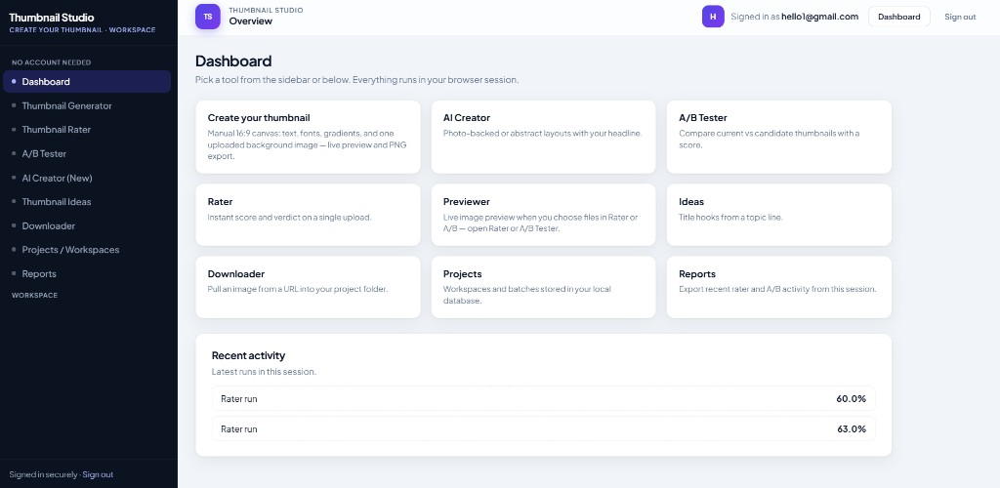
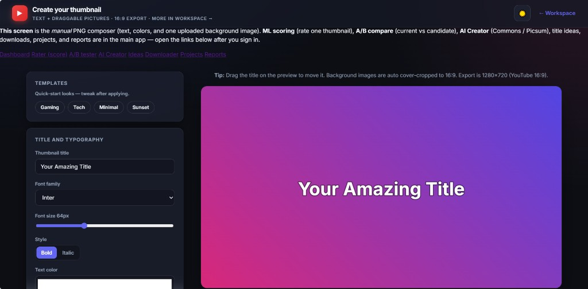
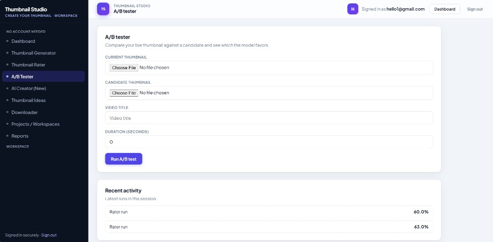
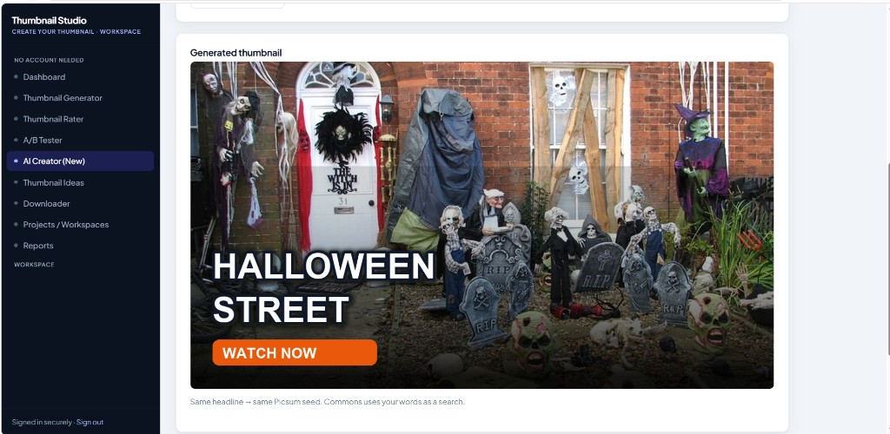

# YouTube Thumbnail Studio

[](.github/workflows/ci.yml)
[](https://www.python.org/downloads/)
[](LICENSE)
[](https://flask.palletsprojects.com/)
[](https://scikit-learn.org/)
[](https://www.sqlite.org/)
[](https://python-pillow.org/)

**End-to-end thumbnail optimization studio for YouTube creators:** collect channel history, train a thumbnail-aware model with optional Studio analytics, score or A/B-test thumbnails, and ship designs through a **local web app** (auth, reporting, visual editor, and free AI composer).

> **Interview angle:** This project demonstrates ownership across the full ML product lifecycle: data ingestion, feature engineering, model training, inference, web UX, auth, persistence, testing, and CI.

---

## Try It Now

- **Live Demo:** [https://youtube-thumbnail-studio.onrender.com](https://youtube-thumbnail-studio.onrender.com)
- **GitHub:** [https://github.com/prekshaaggarwal/youtube-thumbnail-studio](https://github.com/prekshaaggarwal/youtube-thumbnail-studio)

---

## What This Project Does

YouTube Thumbnail Studio is an end-to-end ML + web app that helps creators improve thumbnail decisions with a practical workflow:

- create thumbnail concepts,
- score a design,
- compare two versions (A/B),
- and iterate quickly in one interface.

---

## Core Features

- **Create your thumbnail** (visual editor with image background support, autosave, undo/redo, and keyboard shortcuts)
- **Thumbnail Rater** (predictive scoring)
- **A/B Tester** (head-to-head comparison and recommendation)
- **AI Creator** (fast concept generation)
- **Auth + Workspace** (email/password, optional Google OAuth, project/report flows)

---

## Screenshots






---

## Run Locally

```bash
python -m venv .venv
# Windows:
.venv\Scripts\activate
# macOS/Linux:
# source .venv/bin/activate

pip install -r requirements.txt
python app.py
```

Open `http://127.0.0.1:8080/`.

---

## Deploy (Render)

This repo includes `render.yaml` for blueprint deployment.

1. Push code to GitHub.
2. In Render: **New +** -> **Blueprint**.
3. Select this repo and deploy.

Render runs:

`gunicorn app:app --bind 0.0.0.0:$PORT --workers 2 --threads 4 --timeout 120`

Health check:

`/health`

---

## Tech Stack

- Python, Flask
- scikit-learn, pandas, numpy
- SQLite
- Pillow
- GitHub Actions (CI)

---

## Testing

```bash
python -m pytest tests/ -v
```

---

## License

MIT — see [LICENSE](LICENSE).
